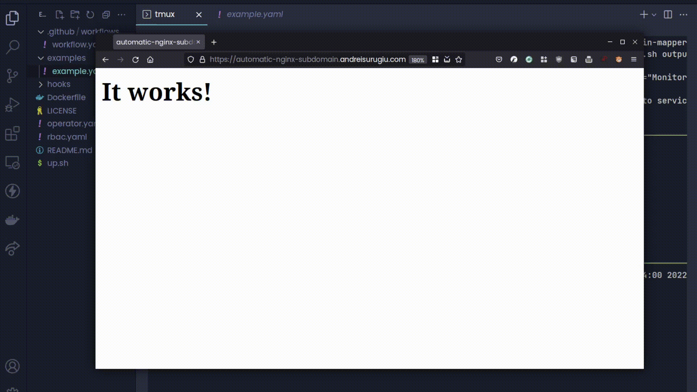

# subdomain-mapper-operator (IN-PROGRESS)


### Why?
I wanted something similar to vercel previews where an environment is created automatically with a subdomain.  

### What?
This operator maps the subdomain `<service_name>.<yourdomain>.<tld>` to `<service_name>`.  

### How?
It watches for new services that have the annotation and patches the ingress when a service is created, modified or removed.  

It uses https://github.com/flant/shell-operator 

## Usage and example

The services must have the following annotation:

```yaml
annotations:
  subdomain-mapper/ingress: "your-ingress-name"
  subdomain-mapper/domain: "your-domain"
```
**example:**  
```yaml
annotations:
  subdomain-mapper/ingress: "main-ingress"
  subdomain-mapper/domain: "andreisurugiu.com"
```

You need to specify the ingress to add the hosts to.

Create the RBAC permissions and the service account:

```sh
# apply rbac.yaml
kubectl apply -f https://raw.githubusercontent.com/DeluxeOwl/subdomain-mapper-operator/main/rbac.yaml
# apply operator.yaml
kubectl apply -f https://raw.githubusercontent.com/DeluxeOwl/subdomain-mapper-operator/main/operator.yaml

# example service and pod
kubectl apply -f https://raw.githubusercontent.com/DeluxeOwl/subdomain-mapper-operator/main/examples/example.yaml
```

## Development

1. Build it yourself (multi-arch):  
```sh
docker buildx ls
docker buildx create --name multi-arch
docker buildx use multi-arch
docker buildx inspect --bootstrap
docker buildx build --platform linux/amd64,linux/arm64,linux/arm/v7 -t username/subdomain-mapper:latest --push .
```  
2. Change the image from [operator.yaml](operator.yaml) to use your image.


### todo
- add tests
